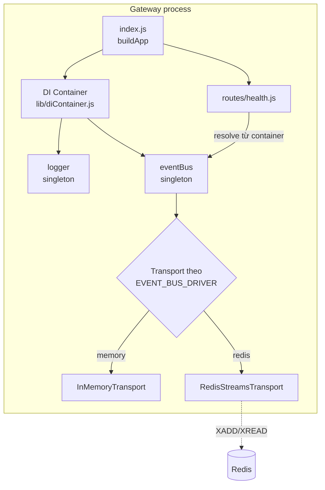

# Sprint 0.3 — Hoàn thiện nền tảng Gateway (CI/CD, Event Bus, DI Container, Testing Framework)

**Giai đoạn:** GĐ1 — Khởi tạo dự án (phần bổ sung, tiếp nối Sprint 0.1–0.2 đã hoàn thành — xem ADR-002)
**Trạng thái:** ✅ Hoàn thành, đã tự kiểm tra (lint + 32 unit/integration test pass)

---

## 1. Mục tiêu

Bổ sung 4 mảnh còn thiếu của Giai đoạn 1 trước khi bước vào Giai đoạn 4 (AI KEF): Dependency
Injection Container, Event Bus, Testing Framework, và CI/CD Pipeline — theo đúng thứ tự ưu tiên
đã chốt ở Development Master Plan Mục 5.

## 2. Phạm vi

**Trong phạm vi:**
- `lib/diContainer.js` — DI container (awilix), Module Registry pattern cho service.
- `lib/eventBus.js` + `domain/DomainEvent.js` — Event Bus với 2 transport (InMemory cho dev/test,
  Redis Streams cho production), pluggable qua biến môi trường `EVENT_BUS_DRIVER`.
- `lib/logger.js` — logger tập trung (pino), phân kênh Application/Audit/Security/System/AI Usage.
- `routes/health.js` + `index.js` — endpoint `GET /api/health` mẫu, minh hoạ auto-mount route và
  dùng DI container + Event Bus.
- Jest config + 32 test case (unit + integration).
- GitHub Actions CI/CD: lint → test → build image → push → deploy staging (tự động) → deploy
  production (cần Manual Approval).
- `docker-compose.yml` bổ sung service `redis` + `gateway`, `docker-compose.override.yml` cho dev.
- 3 ADR (Mục 0 Master Plan) chính thức hoá trong `docs/adr/`.

**Ngoài phạm vi (để Sprint sau):**
- Postgres/Qdrant/Neo4j compose service (thuộc Giai đoạn 4).
- Auth/RBAC nâng cao, Scheduler, Plugin Manager UI, Workflow Engine (thuộc Giai đoạn 2).
- Deploy staging/production thật (hiện là bước `TODO` placeholder trong `ci-cd.yml`, cần thông tin
  hạ tầng thật từ Product Owner: domain, SSH key hoặc registry credentials).

## 3. Thiết kế kiến trúc



- **DI Container**: mọi service mới tự đăng ký qua `registerService(container, name, resolver)`,
  ném lỗi nếu trùng tên — tránh ghi đè âm thầm, đúng Module Registry Pattern.
- **Event Bus**: interface `publish()`/`subscribe()`/`close()` giống nhau bất kể transport
  (Liskov Substitution) — module nghiệp vụ không cần biết đang chạy InMemory hay Redis.
- **DomainEvent**: chuẩn hoá `{eventId, eventType, payload, occurredAt, source, correlationId}`,
  có `toJSON()`/`fromJSON()` để serialize qua Redis Streams.

## 4. Cấu trúc thư mục (file mới trong Sprint 0.3)

```
pwp/
├── docs/adr/
│   ├── ADR-001-gateway-stack.md
│   ├── ADR-002-phase-sprint-mapping.md
│   └── ADR-003-naming-convention.md
├── docker/
│   ├── docker-compose.yml          (mới — service redis + gateway)
│   ├── docker-compose.override.yml (mới — dev hot-reload)
│   ├── .env.example                (mới — biến EVENT_BUS_DRIVER/REDIS_URL)
│   └── gateway/
│       ├── Dockerfile              (mới)
│       ├── .dockerignore           (mới)
│       ├── .eslintrc.json          (mới)
│       ├── jest.config.js          (mới)
│       ├── package.json            (mới)
│       ├── index.js                (mới)
│       ├── lib/
│       │   ├── diContainer.js      (mới)
│       │   ├── eventBus.js         (mới)
│       │   └── logger.js           (mới)
│       ├── domain/
│       │   └── DomainEvent.js      (mới)
│       ├── routes/
│       │   └── health.js           (mới)
│       └── tests/                  (mới, 5 file, 32 test case)
├── .github/workflows/ci-cd.yml     (mới)
└── README_SPRINT0.3.md             (tài liệu này)
```

## 5. Danh sách Module

| Module | Trạng thái |
|---|---|
| Core Framework / DI Container | ✅ Hoàn thành |
| Event Bus | ✅ Hoàn thành |
| Testing Framework (Jest + ESLint) | ✅ Hoàn thành |
| CI/CD Pipeline | ✅ Khung hoàn thành, 2 bước deploy còn placeholder chờ thông tin hạ tầng |

## 6. Danh sách Task

- [x] Khởi tạo `package.json`, cài `awilix`, `express`, `ioredis`, `pino`, `jest`, `eslint`, `supertest`.
- [x] Viết `DomainEvent` + unit test (8 test case).
- [x] Viết `EventBus` + `InMemoryTransport` + `RedisStreamsTransport` + unit test (8 + 6 test case).
- [x] Viết `diContainer.js` (awilix) + unit test (8 test case).
- [x] Viết `logger.js` (pino, phân kênh).
- [x] Viết route mẫu `/api/health` + integration test (2 test case) chứng minh DI + Event Bus hoạt động cùng nhau.
- [x] Cấu hình Jest coverage threshold cho 2 file lõi (`eventBus.js`, `diContainer.js`).
- [x] Viết `Dockerfile` (multi-stage dev/production).
- [x] Viết `docker-compose.yml` + `.override.yml` + `.env.example`.
- [x] Viết GitHub Actions `ci-cd.yml` (lint → test → build → push → staging → production).
- [x] Chính thức hoá 3 ADR đã phê duyệt.
- [x] Tự chạy `npm run lint` và `npm run test:coverage` — xác nhận PASS trước khi bàn giao.

## 7. Phụ thuộc

- Module này là nền tảng cho **mọi Sprint sau** (Giai đoạn 2–7 đều dùng chung DI Container +
  Event Bus). Không có phụ thuộc ngược — đây là lớp thấp nhất.
- Cần Product Owner cấp thông tin hạ tầng thật (SSH/registry credentials, domain staging/production)
  trước khi 2 job `deploy-staging`/`deploy-production` trong CI/CD hoạt động thật (hiện là placeholder).

## 8. Thay đổi Database

Không có — Sprint 0.3 không chạm schema Postgres/Sheets.

## 9. Thay đổi API

Thêm mới: `GET /api/health` — trả `{status, service, version}`, đồng thời publish DomainEvent
`system.health.checked` lên Event Bus (dùng cho Module Monitoring ở Giai đoạn 7).

## 10. Thay đổi Giao diện

Không có — Sprint 0.3 thuần backend/hạ tầng, không đụng GAS.

## 11. Mã nguồn

Toàn bộ nằm trong `docker/gateway/{lib,domain,routes,index.js}` — xem Mục 4.

## 12. Unit Test

32/32 test pass. Chạy: `cd docker/gateway && npm test`

## 13. Integration Test

2 test trong `tests/health.integration.test.js` dùng `supertest` gọi thẳng Express app (không mở
port thật) — xác nhận route + DI container + Event Bus phối hợp đúng.

## 14. Hướng dẫn triển khai (cài đặt & test)

```bash
# 1. Cài dependency
cd docker/gateway
npm install

# 2. Lint
npm run lint

# 3. Test + coverage
npm run test:coverage
# Kỳ vọng: "Test Suites: 5 passed, 5 total" / "Tests: 32 passed, 32 total"

# 4. Chạy thử local (dùng InMemoryTransport, không cần Redis)
EVENT_BUS_DRIVER=memory npm run dev
# Test thủ công:
curl http://localhost:3000/api/health
# Kỳ vọng: {"status":"ok","service":"pwp-gateway","version":"0.3.0"}

# 5. Chạy full stack qua Docker Compose (dùng Redis thật)
cd ../
cp .env.example .env    # điền GATEWAY_API_KEY thật
docker compose up -d --build
docker compose ps       # xác nhận cả 2 container "running"/"healthy"
curl http://localhost:3000/api/health
```

## 15. Checklist kiểm thử (đã tự thực hiện trước khi bàn giao)

- [x] `npm run lint` — 0 lỗi.
- [x] `npm run test:coverage` — 32/32 pass, coverage vượt ngưỡng đã đặt cho `eventBus.js` và `diContainer.js`.
- [x] `docker-compose.yml`/`.override.yml`/`ci-cd.yml` đã validate cú pháp YAML (không có Docker
      daemon trong môi trường phát triển này nên chưa `docker compose up` được thật — **cần Product
      Owner xác nhận `docker compose up -d --build` chạy được trên máy có Docker**).
- [ ] `curl` thật tới `GET /api/health` trên container đã build (Product Owner xác nhận khi có Docker).

## 16. Các rủi ro

| Rủi ro | Ghi chú |
|---|---|
| Chưa test được `docker compose up` thật (môi trường phát triển không có Docker daemon) | Cần Product Owner chạy xác nhận bước 5 ở Mục 14 trước khi coi Sprint thật sự Done theo DoD (`INSTRUCTIONS.md` 7.3 mục "Migration DB chạy thành công từ trạng thái sạch" — ở đây tương đương "Compose up thành công từ trạng thái sạch"). |
| 2 job deploy trong CI/CD còn placeholder | Cần thông tin hạ tầng thật (registry, SSH, domain) — sẽ hoàn thiện ngay khi có, không chặn các Sprint tiếp theo vì lint+test đã chạy thật trong CI. |
| RedisStreamsTransport mới test bằng mock `ioredis`, chưa test với Redis thật | Rủi ro thấp (API ioredis ổn định), nhưng nên có 1 lượt test thủ công `EVENT_BUS_DRIVER=redis` + `docker compose up` thật ở lần review đầu tiên. |

## 17. Khả năng mở rộng trong tương lai

- Thêm transport mới cho Event Bus (vd: RabbitMQ) chỉ cần implement `publish()`/`subscribe()`/`close()`
  và thêm 1 nhánh trong `buildEventBusTransport()` — không sửa `EventBus` core.
- Mọi `services/*.js` ở Giai đoạn 4 trở đi tự đăng ký vào `diContainer` bằng `registerService()`
  có sẵn, không cần sửa `index.js`.
- `DomainEvent` là nền tảng để Giai đoạn 7 (Monitoring) subscribe `'*'` và ghi toàn bộ event vào
  Loki mà không cần sửa module nghiệp vụ nào phát sinh event.

---
*Chờ Product Owner chạy xác nhận Mục 15 (Docker thật) để đóng Sprint 0.3, sau đó mở Sprint 1.1
(Document Parser — Giai đoạn 4 AI KEF) theo đúng Master Plan.*
