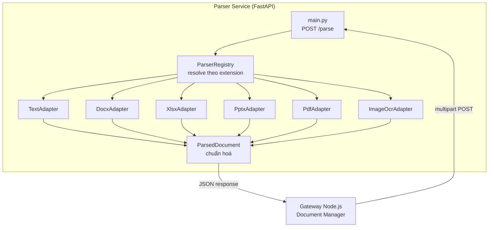

# Sprint 1.1 — Document Parser Service (Giai đoạn 4: AI Knowledge Engineering Framework)

**Trạng thái:** ✅ Hoàn thành phần lõi 6 định dạng phổ biến, đã tự kiểm tra (lint sạch + 35/35 test pass)

---

## 1. Mục tiêu

Xây dựng Document Parser Service — bước đầu tiên của Giai đoạn 4 AI KEF — chuẩn hoá MỌI định
dạng tài liệu presales phổ biến (Word, Excel, PowerPoint, PDF, Markdown/HTML, ảnh scan) thành
1 cấu trúc dữ liệu duy nhất (`ParsedDocument`) để Metadata Engine và Embedding Engine (Sprint
1.2–1.3) dùng chung mà không cần biết định dạng gốc là gì.

## 2. Phạm vi

**Trong phạm vi (Sprint 1.1):**
- Service Python/FastAPI độc lập `docker/ai-services/parser-service/` (theo ADR-001).
- 6 adapter: TXT/Markdown/HTML, DOCX, XLSX, PPTX, PDF, Image OCR (eng+vie).
- Endpoint `POST /parse`, `GET /parsers`, `GET /health`.
- Parser Registry (Plugin Architecture) — thêm định dạng mới không sửa code cũ.

**Ngoài phạm vi — dời sang Sprint 1.1b (quyết định phạm vi có chủ đích, không phải bỏ sót):**
- ~~CAD (DWG/DXF), Visio, Draw.io~~ — **Đã hoàn thành ở Sprint 1.1b, xem `README_SPRINT1.1b.md`.**
  (DXF/VSDX/Draw.io hỗ trợ thật; DWG trả lỗi rõ ràng kèm hướng dẫn convert sang DXF vì đây là
  định dạng nhị phân độc quyền không có thư viện mở nào đọc được.)
- Email (.eml/.msg), ZIP (giải nén đệ quy rồi parse từng file con), Revision History đầy đủ cho
  DOCX (hiện chỉ trích Comments, chưa trích Track Changes chi tiết).
- Tích hợp thật với Document Manager (Node.js Gateway) để tự động gọi `/parse` khi có tài liệu
  mới/thay đổi — đây thuộc Sprint 1.2 (Metadata Engine + Sync nâng cao).

## 3. Thiết kế kiến trúc



- **Interface Segregation**: `ParserAdapter` chỉ yêu cầu 2 hàm (`supported_extensions`,
  `parse()`) — giống hệt triết lý `DocumentConnector.scan()` bên Gateway (INSTRUCTIONS.md 4.2).
- **Liskov Substitution**: mọi adapter trả về cùng 1 kiểu `ParsedDocument`; endpoint `/parse`
  không cần biết đang xử lý DOCX hay PDF.
- **Fail gracefully theo từng phần**: PdfAdapter không hỏng cả tài liệu nếu 1 trang lỗi (chỉ
  thêm vào `warnings`); ImageOcrAdapter trả ảnh gốc kèm ghi chú OCR lỗi thay vì từ chối cả file.

## 4. Cấu trúc thư mục

```
docker/ai-services/parser-service/
├── Dockerfile                  # python:3.12-slim + tesseract-ocr + tesseract-ocr-vie
├── .dockerignore
├── requirements.txt             # production
├── requirements-dev.txt         # chỉ cho fixture test (fpdf2)
├── ruff.toml                    # lint config (line-length=120 vì comment tiếng Việt)
├── app/
│   ├── main.py                  # FastAPI entrypoint
│   ├── config.py                # Settings từ biến môi trường
│   ├── registry.py              # ParserRegistry + default_registry()
│   ├── domain/
│   │   └── parsed_document.py   # ParsedDocument, ParsedTable, ParsedImage, Metadata
│   └── adapters/
│       ├── base.py              # ParserAdapter interface + exceptions
│       ├── text_adapter.py
│       ├── docx_adapter.py
│       ├── xlsx_adapter.py
│       ├── pptx_adapter.py
│       ├── pdf_adapter.py
│       └── image_ocr_adapter.py
└── tests/
    ├── conftest.py               # sinh fixture động (không commit file nhị phân)
    └── test_*.py                 # 35 test case
```

## 5. Danh sách Module

| Module | Trạng thái |
|---|---|
| ParsedDocument (domain model) | ✅ Hoàn thành |
| ParserAdapter interface + Registry | ✅ Hoàn thành |
| TextAdapter (txt/md/html) | ✅ Hoàn thành |
| DocxAdapter | ✅ Hoàn thành |
| XlsxAdapter | ✅ Hoàn thành |
| PptxAdapter | ✅ Hoàn thành |
| PdfAdapter | ✅ Hoàn thành |
| ImageOcrAdapter | ✅ Hoàn thành |
| CAD/Visio/Draw.io adapter | ⏳ Sprint 1.1b |
| Tích hợp Document Manager → Parser Service | ⏳ Sprint 1.2 |

## 6. Danh sách Task

- [x] Cài đặt môi trường Python (fastapi, pdfplumber, python-docx, openpyxl, python-pptx, pytesseract, Pillow, beautifulsoup4, Markdown).
- [x] Viết `ParsedDocument`/`ParsedTable`/`ParsedImage`/`ParsedDocumentMetadata` (Pydantic).
- [x] Viết `ParserAdapter` interface + `ParsingError`/`UnsupportedFileTypeError`.
- [x] Viết 6 adapter cụ thể, mỗi adapter có unit test riêng (bắt lỗi file hỏng, trích đúng text/table/image).
- [x] Viết `ParserRegistry` + test chống đăng ký trùng extension.
- [x] Viết `main.py` (FastAPI) + test tích hợp (health/parsers/parse thành công/415/422/413).
- [x] Viết `Dockerfile` (cài tesseract-ocr + tesseract-ocr-vie qua apt).
- [x] Thêm service `parser-service` vào `docker-compose.yml`.
- [x] Thêm job `lint-and-test-parser-service` + `build-image-parser-service` vào `ci-cd.yml`.
- [x] Tự chạy `ruff check` (sạch) và `pytest` (35/35 pass) trước khi bàn giao.

## 7. Phụ thuộc

- Phụ thuộc DI Container/Event Bus của Sprint 0.3? **Không trực tiếp** — Parser Service là
  service Python độc lập, không dùng chung process với Gateway Node.js (đúng ADR-001).
- Là phụ thuộc **đầu vào** cho Sprint 1.2 (Metadata Engine sẽ gọi `/parse` rồi phân tích kết quả)
  và Sprint 1.3 (Embedding Engine sẽ chunk `ParsedDocument.text`).
- Cần `tesseract-ocr`/`tesseract-ocr-vie` cài trong image — đã khai báo trong `Dockerfile`.

## 8. Thay đổi Database

Không có — Parser Service không lưu trữ, chỉ xử lý và trả kết quả (stateless), đúng vai trò
"Parser" thuần trong kiến trúc AI KEF (`AI Knowledge Engineering Framework.docx` mục 3).

## 9. Thay đổi API

Endpoint mới (Parser Service, port 8001, nội bộ — Gateway gọi qua REST, chưa expose ra ngoài):
- `POST /parse` (multipart file) → `ParsedDocument` JSON
- `GET /parsers` → danh sách extension hỗ trợ
- `GET /health` → `{status, service, version}`

## 10. Thay đổi Giao diện

Không có ở Sprint 1.1 — thuần backend xử lý.

## 11. Mã nguồn

`docker/ai-services/parser-service/app/` — xem Mục 4.

## 12. Unit Test

30 unit test (6 adapter × ~4–6 test case, gồm cả test mới cho `DependencyUnavailableError`/
`tesseract_cmd` + Registry 5 test case) — chạy:
```bash
cd docker/ai-services/parser-service
PYTHONPATH=. python -m pytest -v
```

## 13. Integration Test

5 test trong `tests/test_main_api.py` dùng FastAPI `TestClient` — xác nhận `/health`, `/parsers`,
`/parse` thành công (DOCX thật), và 4 kịch bản lỗi (415 định dạng không hỗ trợ, 422 file hỏng,
503 thiếu Tesseract, 413 vượt giới hạn dung lượng).

## 14. Hướng dẫn triển khai (cài đặt & test) — Windows

> **Cập nhật từ Sprint 1.2:** trước khi chạy lại bất kỳ bước nào dưới đây, hãy chạy
> `.\scripts\windows\stop-all-windows.ps1` (xem `README_SPRINT1.2.md`) để dừng mọi service cũ
> đang giữ cổng — tránh đúng lỗi "code mới tưởng không hoạt động" đã gặp ở Sprint 1.1b.

> Dùng **PowerShell** (mặc định trên Windows 10/11). Nếu dùng Command Prompt (cmd.exe), thay
> bước kích hoạt virtualenv bằng `.venv\Scripts\activate.bat` — các bước còn lại giống nhau.

### 0. Cài Tesseract OCR (bắt buộc riêng, KHÔNG cài được qua `pip`)

`pytesseract` (thư viện Python) chỉ là lớp gọi tới chương trình `tesseract.exe` của hệ điều
hành — nó **không tự cài** khi chạy `pip install`. Nếu bỏ qua bước này, test
`test_parse_ocr_ra_text` và mọi request `/parse` với file ảnh sẽ báo lỗi
`TesseractNotFoundError` (đã gặp ở lần chạy trước).

1. Tải bộ cài Windows tại: https://github.com/UB-Mannheim/tesseract/wiki (bản UB-Mannheim,
   là bản build Windows được cộng đồng tesseract khuyến nghị chính thức).
2. Khi cài, ở màn hình chọn gói ngôn ngữ (**"Additional language data"**), tick thêm
   **Vietnamese** (mặc định chỉ có English) — vì `PARSER_OCR_LANGUAGES` mặc định là `eng+vie`.
3. Ghi nhớ đường dẫn cài đặt, mặc định: `C:\Program Files\Tesseract-OCR\tesseract.exe`.
4. Cấu hình 1 trong 2 cách (chọn 1):
   - **Cách A — khuyến nghị, không cần sửa PATH hệ thống:** đặt biến môi trường
     `PARSER_TESSERACT_CMD` trỏ thẳng tới file `tesseract.exe` (xem bước 3 ở dưới).
   - **Cách B:** thêm `C:\Program Files\Tesseract-OCR` vào biến môi trường `PATH` của Windows
     (Settings → System → About → Advanced system settings → Environment Variables), sau đó
     **mở lại** cửa sổ PowerShell mới để PATH có hiệu lực.

### 1–5. Cài đặt & test

```powershell
cd docker\ai-services\parser-service

# 1. Tạo virtualenv + cài dependency
python -m venv .venv
.venv\Scripts\Activate.ps1
pip install -r requirements.txt -r requirements-dev.txt ruff

# 2. Cấu hình đường dẫn tesseract (Cách A ở Mục 0) — đổi lại đúng đường dẫn máy bạn
$env:PARSER_TESSERACT_CMD = "C:\Program Files\Tesseract-OCR\tesseract.exe"

# 3. Lint
ruff check app tests
# Kỳ vọng: "All checks passed!"

# 4. Test
$env:PYTHONPATH = "."
python -m pytest -v
# Kỳ vọng: "35 passed"

# 5. Chạy thử local
uvicorn app.main:app --reload --port 8001

# Mở cửa sổ PowerShell/terminal KHÁC để test (giữ nguyên cửa sổ trên đang chạy uvicorn):
curl.exe http://localhost:8001/health
curl.exe http://localhost:8001/parsers

# Test thủ công /parse với 1 file DOCX thật (đổi đường dẫn cho đúng máy bạn):
curl.exe -X POST http://localhost:8001/parse -F "file=@C:\Users\<ten-may>\Documents\file.docx"

# 6. Chạy qua Docker Compose (cùng Gateway + Redis) — yêu cầu Docker Desktop for Windows
# LƯU Ý: image Docker đã tự cài tesseract-ocr qua apt (xem Dockerfile) — KHÔNG cần
# PARSER_TESSERACT_CMD khi chạy theo cách này, để trống biến đó trong .env là đúng.
cd ..\..
Copy-Item .env.example .env
docker compose up -d --build
curl.exe http://localhost:8001/health
```

**Lưu ý Windows:**
- Dùng `curl.exe` (không phải `curl`) để chắc chắn gọi curl thật của Windows, tránh trùng với
  alias `curl` → `Invoke-WebRequest` mà PowerShell định nghĩa sẵn (cú pháp tham số khác nhau).
- Nếu PowerShell báo lỗi "không cho phép chạy script" khi kích hoạt virtualenv, chạy 1 lần:
  `Set-ExecutionPolicy -Scope CurrentUser RemoteSigned` rồi thử lại `.venv\Scripts\Activate.ps1`.
- Đường dẫn Windows dùng `\` — khi copy đường dẫn file cho `curl.exe -F "file=@..."`, giữ nguyên
  dấu `\` (không cần đổi thành `/`).
- `$env:PARSER_TESSERACT_CMD` (Mục 2) chỉ có hiệu lực trong cửa sổ PowerShell hiện tại. Muốn
  giữ lâu dài qua các lần mở terminal mới, đặt biến môi trường User trong Windows Settings thay
  vì gõ lại `$env:...` mỗi lần, hoặc dùng file `.env` khi chạy qua Docker Compose (Mục 6).

## 15. Checklist kiểm thử (đã tự thực hiện)

- [x] `ruff check app tests` — "All checks passed!"
- [x] `pytest` — 35/35 pass (chạy trong sandbox Linux của tôi, có tesseract-ocr cài sẵn).
- [x] **Xác nhận thật trên Windows 11 (Product Owner đã chạy, phát hiện gap thiếu hướng dẫn cài
      Tesseract OCR cho Windows — đã sửa Mục 0/2 ở trên và bổ sung `DependencyUnavailableError`
      để lỗi hiện rõ ràng thay vì traceback khó hiểu).** Cần chạy lại `pytest -v` sau khi cài
      Tesseract theo Mục 0 để xác nhận đủ 35/35 pass trên Windows.
- [x] Test thực tế OCR với tesseract cài sẵn trong môi trường phát triển (không phải mock) —
      xác nhận `pytesseract.image_to_string()` chạy thật và nhận diện được text trên ảnh test.
- [ ] `docker compose up -d --build` thật trên máy có Docker Desktop for Windows.
- [ ] Test thủ công `/parse` với file DOCX/PDF/XLSX **thật** của dự án (không phải fixture sinh
      động) — khuyến nghị thử ít nhất 1 file mẫu thật từ thư mục dự án Presales trước khi coi
      Sprint 1.1 Done hoàn toàn, vì fixture test dùng file tự sinh đơn giản, có thể không phản
      ánh hết độ phức tạp của tài liệu thật (nhiều cột lồng nhau, ảnh nhúng phức tạp, macro...).

## 16. Các rủi ro

| Rủi ro | Ghi chú |
|---|---|
| ~~Thiếu hướng dẫn cài Tesseract OCR cho Windows khi chạy local (ngoài Docker)~~ | **Đã sửa** — phát hiện khi Product Owner chạy thật trên Windows 11 (31/32 pass, 1 fail `TesseractNotFoundError`). Đã thêm Mục 0 (cài Tesseract UB-Mannheim) + `DependencyUnavailableError`/`PARSER_TESSERACT_CMD` để lỗi rõ ràng và cấu hình được không cần sửa PATH hệ thống. |
| Fixture test tự sinh đơn giản hơn nhiều so với tài liệu thật | Đã ghi rõ ở Mục 15 — cần test bổ sung với file thật trước khi Done hoàn toàn. |
| `python-docx` không có API chính thức đọc comments ở mọi phiên bản | Đã dùng cách đọc trực tiếp `comments.xml` (best-effort, có try/except), có thể cần điều chỉnh nếu cấu trúc DOCX đặc biệt. |
| Chưa test được `docker compose up` thật trên Windows | Cần Product Owner xác nhận trên máy có Docker Desktop. |
| CAD/Visio/Draw.io chưa hỗ trợ | Đã ghi rõ là quyết định phạm vi có chủ đích (Mục 2), không phải rủi ro ẩn — dời sang Sprint 1.1b. |
| OCR tiếng Việt có thể độ chính xác chưa cao với ảnh chất lượng thấp/font lạ | Cần đánh giá thêm với ảnh scan thật của dự án; nếu chưa đạt, cân nhắc thêm bước tiền xử lý ảnh (deskew, threshold) ở Sprint 1.1b. Lưu ý: khi cài Tesseract trên Windows, phải tick chọn gói ngôn ngữ Vietnamese ở bước cài đặt (Mục 0), mặc định trình cài không có sẵn. |

## 17. Khả năng mở rộng trong tương lai

- Thêm adapter CAD/Visio/Draw.io chỉ cần 1 class mới implement `ParserAdapter` + 1 dòng
  `registry.register()` trong `default_registry()` — không sửa `main.py` hay adapter khác.
- `ParsedDocument.content_hash_input()` đã có sẵn để Sprint 1.2 (Metadata Engine) tính
  `content_hash` phát hiện tài liệu trùng lặp (FR-DOC-04) mà không cần thêm logic ở Parser Service.
- `ParsedImage.content_base64` lưu sẵn ảnh gốc để Sprint 1.3 (Embedding Engine) có thể dùng
  multimodal embedding sau này mà không cần parse lại file gốc.
- Endpoint `/parse` có thể thêm tham số `?ocr_languages=` để override cấu hình mặc định theo
  từng request cụ thể (hiện tại cấu hình toàn service qua `PARSER_OCR_LANGUAGES`).

---
*Chờ Product Owner: (1) xác nhận Docker thật, (2) thử `/parse` với ít nhất 1 file thật từ dự
án. Sau đó mở Sprint 1.2 (Metadata Engine + Sync nâng cao Delta API) theo Master Plan.*
