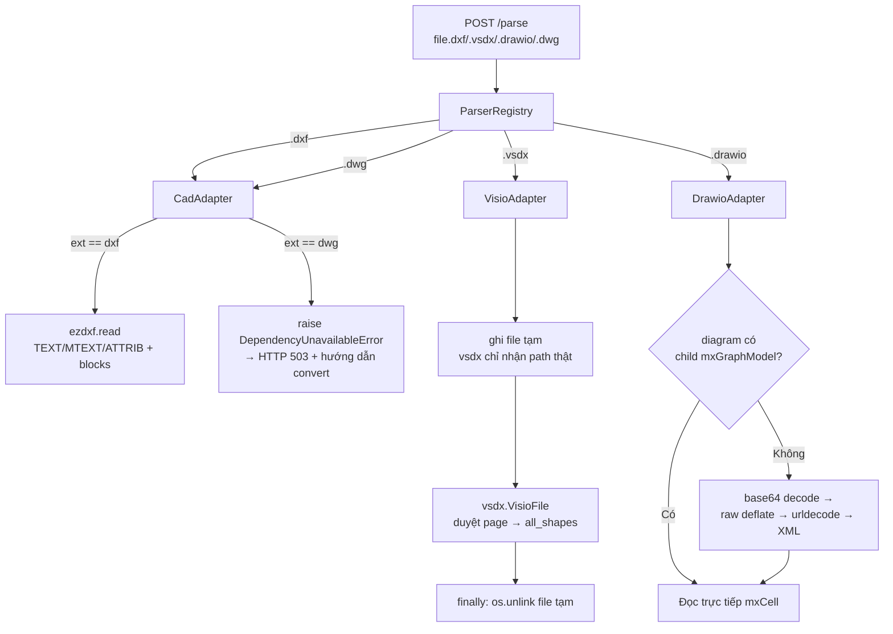

# Sprint 1.1b — CAD (DXF)/Visio/Draw.io Adapter (Giai đoạn 4: AI Knowledge Engineering Framework)

**Trạng thái:** ✅ Hoàn thành, đã tự kiểm tra (lint sạch + 49/49 test pass)
**Tiếp nối:** Sprint 1.1 (README_SPRINT1.1.md) — phần phạm vi đã dời có chủ đích ở Mục 2 của Sprint 1.1.

---

## 1. Mục tiêu

Bổ sung khả năng đọc sơ đồ kỹ thuật — định dạng phổ biến trong hồ sơ presales hạ tầng (sơ đồ
mạng, sơ đồ rack, kiến trúc giải pháp) mà Sprint 1.1 đã cố ý dời lại: CAD (DXF), Visio (VSDX),
Draw.io.

## 2. Phạm vi

**Trong phạm vi:**
- `.dxf` — hỗ trợ THẬT qua `ezdxf` (trích TEXT/MTEXT/ATTRIB/block name theo layer).
- `.vsdx` — hỗ trợ THẬT qua `vsdx` (trích text mọi shape theo từng page).
- `.drawio` — hỗ trợ THẬT qua XML parser tự viết, xử lý **cả 2 dạng con**: XML thô và XML nén
  base64(deflate(urlencode(...))) (mặc định khi lưu từ app.diagrams.net web).
- `.dwg` — **đăng ký nhưng KHÔNG parse được nội dung**, trả lỗi 503 kèm hướng dẫn convert sang
  DXF cụ thể (xem Mục 3). Đây là quyết định trung thực: `.dwg` là định dạng nhị phân độc quyền,
  không có thư viện Python mở nào đọc được mà không qua ODA File Converter (phần mềm ngoài).

**Ngoài phạm vi (chưa làm, ghi nhận rõ ràng):**
- Hình học (đường, vòng tròn, kích thước) của DXF — mới trích **text/block**, chưa trích toạ độ
  hình học để dựng lại bản vẽ. Đủ cho mục đích Knowledge Base/tìm kiếm ngữ nghĩa (Sprint 1.2+),
  chưa đủ để "xem lại sơ đồ" trực quan từ dữ liệu đã parse.
- `.vsd` (Visio định dạng cũ, nhị phân, trước 2013) — chỉ hỗ trợ `.vsdx` (OOXML, từ Visio 2013+).
- Tự động convert DWG→DXF (cần tích hợp ODA File Converter dạng CLI trong container, cân nhắc
  Sprint sau nếu nhu cầu thực tế cao — hiện tại dừng ở mức hướng dẫn thủ công).

## 3. Thiết kế kiến trúc



- **Nhất quán với ADR đã có**: `.dwg` xử lý bằng đúng pattern `DependencyUnavailableError` đã
  tạo ra ở Sprint 1.1 (patch) cho Tesseract — tái dùng kiến trúc thay vì phát minh cơ chế mới.
- **VisioAdapter dọn file tạm trong `finally`** — có test riêng xác nhận không rò rỉ file
  (`test_parse_khong_ro_ri_file_tam_trong_thu_muc_temp_he_thong`).
- **DrawioAdapter tự phát hiện dạng con** (thô/nén) thay vì bắt người dùng khai báo — giảm khả
  năng lỗi khi Document Manager tự động gửi file (Sprint 1.2) mà không biết trước dạng lưu.

## 4. Cấu trúc thư mục (file mới)

```
docker/ai-services/parser-service/
├── requirements.txt              # + ezdxf==1.4.4, vsdx==0.6.1
├── app/adapters/
│   ├── cad_adapter.py            # mới — DXF thật, DWG → DependencyUnavailableError
│   ├── visio_adapter.py          # mới
│   └── drawio_adapter.py         # mới
├── app/registry.py                # sửa — đăng ký 3 adapter mới
└── tests/
    ├── conftest.py                 # sửa — thêm 4 fixture (dxf, vsdx, drawio thô, drawio nén)
    ├── test_cad_adapter.py        # mới
    ├── test_visio_adapter.py       # mới
    ├── test_drawio_adapter.py      # mới
    ├── test_registry.py            # sửa — test đủ 12 extension
    └── test_main_api.py            # sửa — 415 đổi ví dụ, thêm test .dwg → 503
```

## 5. Danh sách Module

| Module | Trạng thái |
|---|---|
| CadAdapter (.dxf thật, .dwg → hướng dẫn convert) | ✅ Hoàn thành |
| VisioAdapter (.vsdx) | ✅ Hoàn thành |
| DrawioAdapter (.drawio, cả 2 dạng con) | ✅ Hoàn thành |
| DWG parse trực tiếp (không qua convert thủ công) | ⏳ Ngoài phạm vi — xem Mục 2 |
| Trích xuất hình học DXF/Visio (không chỉ text) | ⏳ Ngoài phạm vi — xem Mục 2 |

## 6. Danh sách Task

- [x] Khảo sát thư viện: `ezdxf` (DXF, chủ động chọn vì đây là thư viện DXF Python phổ biến
      nhất, đọc/ghi đầy đủ), `vsdx` (Visio, thuần Python, không cần COM/Windows-only API).
- [x] Viết `CadAdapter`: đọc TEXT/MTEXT/ATTRIB/ATTDEF + tên block + layer phát hiện được; `.dwg`
      trả `DependencyUnavailableError` với hướng dẫn convert cụ thể (không phải lỗi chung chung).
- [x] Viết `VisioAdapter`: xử lý giới hạn kỹ thuật của thư viện `vsdx` (chỉ nhận file path thật,
      không nhận `BytesIO`) bằng file tạm + dọn dẹp `finally`.
- [x] Viết `DrawioAdapter`: tự phát hiện và xử lý cả 2 dạng lưu (XML thô/nén), strip HTML trong
      nhãn shape, đưa nhãn trên edge vào `references` (khác `text` chính, vì đó là mô tả quan hệ).
- [x] Đăng ký 3 adapter vào `default_registry()`.
- [x] Viết fixture sinh động cho cả 3 định dạng (dùng chính `ezdxf`/`vsdx` để tạo file test, dùng
      template `media.vsdx` có sẵn trong thư viện `vsdx` thay vì tự tạo VSDX từ đầu).
- [x] 17 test case mới (CAD 4, Visio 4, Draw.io 4, Registry sửa 1, API sửa/thêm 2).
- [x] Sửa test cũ `test_parse_dinh_dang_khong_ho_tro_tra_415` — `.dwg` giờ có adapter đăng ký
      (trả 503, không còn 415), đổi ví dụ sang `.rvt` (Revit, thực sự chưa có adapter nào).
- [x] Tự chạy `ruff check` (sạch) và `pytest` (49/49 pass) trước khi bàn giao.

## 7. Phụ thuộc

- Phụ thuộc trực tiếp `DependencyUnavailableError`/pattern xử lý lỗi hạ tầng đã tạo ở Sprint 1.1
  (patch) — tái sử dụng nguyên vẹn, không viết lại.
- Không cần thêm binary hệ điều hành trong `Dockerfile` (khác OCR cần `tesseract-ocr`) — `ezdxf`
  và `vsdx` là thư viện Python thuần, chỉ cần khai báo trong `requirements.txt`.

## 8. Thay đổi Database

Không có.

## 9. Thay đổi API

Không có endpoint mới — `POST /parse` giờ chấp nhận thêm 4 extension (`dxf`, `dwg`, `vsdx`,
`drawio`). Hành vi mới: gửi file `.dwg` trả **503** (trước Sprint 1.1b sẽ trả 415 vì chưa có
adapter nào đăng ký cho `.dwg`).

## 10. Thay đổi Giao diện

Không có.

## 11. Mã nguồn

`app/adapters/cad_adapter.py`, `app/adapters/visio_adapter.py`, `app/adapters/drawio_adapter.py`,
`app/registry.py` (sửa) — xem Mục 4.

## 12. Unit Test

17 test case mới cho 3 adapter + Registry. Tổng cộng dự án hiện có 49 test. Chạy:
```powershell
cd docker\ai-services\parser-service
$env:PYTHONPATH = "."
python -m pytest -v
```

## 13. Integration Test

Cập nhật `tests/test_main_api.py`: đổi ví dụ 415 sang `.rvt` (vì `.dwg` giờ có adapter, trả 503
thay vì 415), thêm test `.dwg` → 503 kèm nội dung hướng dẫn "DXF" trong response.

## 14. Hướng dẫn triển khai (cài đặt & test) — Windows

> **Cập nhật từ Sprint 1.2:** chạy `.\scripts\windows\stop-all-windows.ps1` trước khi bắt đầu,
> xem `README_SPRINT1.2.md`.

```powershell
cd docker\ai-services\parser-service

# Nếu đã có virtualenv từ Sprint 1.1, chỉ cần cài thêm 2 thư viện mới:
.venv\Scripts\Activate.ps1
pip install -r requirements.txt   # đã bao gồm ezdxf, vsdx mới thêm

# Lint + test như Sprint 1.1
ruff check app tests
$env:PYTHONPATH = "."
python -m pytest -v
# Kỳ vọng: "49 passed"

# Test thủ công với file DXF/VSDX/Draw.io thật (đổi đường dẫn cho đúng máy bạn):
uvicorn app.main:app --reload --port 8001
# (mở terminal khác)
curl.exe -X POST http://localhost:8001/parse -F "file=@C:\path\to\sodo.dxf"
curl.exe -X POST http://localhost:8001/parse -F "file=@C:\path\to\kientruc.vsdx"
curl.exe -X POST http://localhost:8001/parse -F "file=@C:\path\to\sodo.drawio"

# Test hành vi DWG (kỳ vọng lỗi 503 kèm hướng dẫn, KHÔNG phải crash):
curl.exe -X POST http://localhost:8001/parse -F "file=@C:\path\to\model.dwg"
```

## 15. Checklist kiểm thử (đã tự thực hiện)

- [x] `ruff check app tests` — "All checks passed!"
- [x] `pytest` — 49/49 pass (chạy trong sandbox Linux — cần Product Owner xác nhận lại trên
      Windows theo đúng bài học từ Sprint 1.1, vì lần trước phát hiện gap môi trường chỉ khi
      chạy thật trên Windows).
- [x] Test round-trip thật với `ezdxf`/`vsdx` (tự tạo file bằng chính thư viện, không phải mock)
      để xác nhận adapter đọc đúng dữ liệu thật, không chỉ đọc được cấu trúc rỗng.
- [ ] Test thủ công với ít nhất 1 file `.dxf`/`.vsdx`/`.drawio` **thật** từ dự án presales (bản
      vẽ rack, sơ đồ mạng thật) — fixture test hiện tại đơn giản hơn nhiều so với bản vẽ CAD/sơ
      đồ Visio thực tế (nhiều layer, block lồng nhau, style phức tạp).
- [ ] Xác nhận file `.dwg` thật (không phải nội dung giả trong test) cũng trả 503 rõ ràng thay vì
      lỗi khác (dwg thật có magic bytes khác hẳn, nên hành vi có thể khác nội dung giả dùng trong
      test — về lý thuyết vẫn đúng vì check theo *extension* chứ không đọc nội dung trước khi
      raise, nhưng nên xác nhận thực tế 1 lần).

## 16. Các rủi ro

| Rủi ro | Ghi chú |
|---|---|
| DXF chỉ đọc được bản ASCII (không phải Binary DXF hiếm gặp) | `ezdxf.read()` dùng text stream; Binary DXF cần `ezdxf.readfile()` với path thật — có thể bổ sung nếu gặp nhu cầu thực tế, hiện chưa có test cho trường hợp này. |
| DXF adapter mới trích **text**, chưa trích **hình học** (đường/vòng tròn/kích thước) | Đã ghi rõ ở Mục 2 — đủ cho Knowledge Base tìm kiếm ngữ nghĩa, chưa đủ để hiển thị lại bản vẽ. |
| Thư viện `vsdx` (0.6.1) là dự án cộng đồng, không phải thư viện chính thức Microsoft | Rủi ro thấp cho mục đích đọc text (đã test round-trip thật), nhưng có thể gặp file Visio phức tạp (macro, OLE object nhúng) mà thư viện chưa hỗ trợ đầy đủ — nên test với file thật trước khi coi là đáng tin cậy 100%. |
| Draw.io: chỉ lấy `value` của `mxCell`, chưa xử lý style-based text (label nằm trong `<UserObject>` thay vì `mxCell` trực tiếp — 1 số phiên bản draw.io cũ dùng cấu trúc này) | Rủi ro thấp, phần lớn file hiện đại dùng `mxCell` trực tiếp; bổ sung nếu gặp thực tế. |

## 17. Khả năng mở rộng trong tương lai

- Thêm `.vsd` (Visio nhị phân cũ) chỉ cần 1 adapter mới dùng thư viện khác (`vsd` hoặc chuyển đổi
  qua LibreOffice headless) — không sửa `VisioAdapter` hiện tại.
- Tích hợp ODA File Converter (CLI) vào container riêng nếu nhu cầu đọc `.dwg` thật trở nên cấp
  thiết — khi đó chỉ cần sửa `CadAdapter.parse()` nhánh `.dwg` để gọi converter rồi tái dùng
  logic `ezdxf` đã có, không cần viết lại phần trích text.
- `CadAdapter` có thể mở rộng trích thêm entity hình học (LINE, CIRCLE, LWPOLYLINE với toạ độ)
  vào 1 field mới của `ParsedDocument` (vd: `geometry: List[dict]`) nếu Sprint sau cần dựng lại
  preview bản vẽ, không ảnh hưởng phần text đã có.

---
*Chờ Product Owner: (1) xác nhận 49/49 test pass trên Windows, (2) thử với file DXF/VSDX/Draw.io
thật. Sau đó mở Sprint 1.2 (Metadata Engine + Sync nâng cao Delta API) theo Master Plan.*
