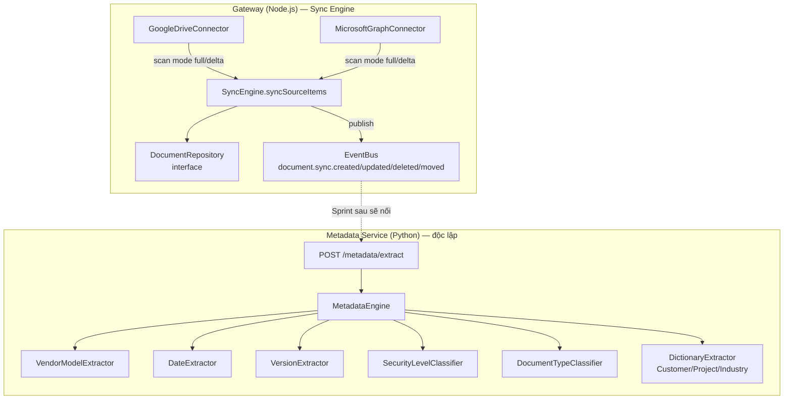

# Sprint 1.2 — Metadata Engine + Sync Engine nâng cao (Delta API)

**Giai đoạn:** GĐ4 — AI Knowledge Engineering Framework
**Trạng thái:** ✅ Hoàn thành, đã tự kiểm tra (lint sạch cả 2 phần + 64/64 test Gateway + 44/44 test Metadata Service)

---

> ## ⚠️ BẮT BUỘC đọc trước khi cài đặt: luôn STOP service cũ trước
>
> Ở Sprint 1.1b, chúng ta đã gặp lỗi tưởng là "code mới không hoạt động" nhưng thực ra là **1
> tiến trình cũ vẫn giữ cổng và âm thầm trả lời bằng code CŨ**. Từ Sprint 1.2 trở đi, **MỌI
> hướng dẫn cài đặt bên dưới đều bắt đầu bằng bước dừng toàn bộ service cũ**, dùng script có sẵn:
>
> ```powershell
> cd C:\PWP
> .\scripts\windows\stop-all-windows.ps1
> ```
>
> Script này tự động: dừng Docker Compose, tìm và dừng mọi tiến trình đang giữ cổng
> 8001/8002/3000, dừng mọi tiến trình `python`/`uvicorn`/`node` còn sót. Chạy script này **trước
> mỗi lần** bạn khởi động lại service để test code mới — không chỉ ở Sprint này mà cho mọi Sprint
> sau.

---

## 1. Mục tiêu

Hai module độc lập nhưng cùng phục vụ Giai đoạn 4 (AI KEF):
1. **Metadata Engine** (Python/FastAPI mới): tự động nhận diện Customer/Vendor/Model/Ngày/
   Version/Security Level/Document Type/Industry từ văn bản đã parse (input từ Parser Service).
2. **Sync Engine nâng cao** (Node.js Gateway): nâng cấp từ full-scan sang **Delta API** thật cho
   Google Drive (`changes.list`) và Microsoft Graph (`delta` query) — đúng INSTRUCTIONS.md 6.5.

## 2. Phạm vi

**Trong phạm vi:**
- `MetadataEngine` với 6 extractor: Vendor/Model (regex + dictionary), Date, Version, Security
  Level (keyword), Document Type (keyword + filename), Customer/Project/Industry (dictionary).
- `SyncEngine` hỗ trợ 2 chế độ: `full` (reconciliation như cũ) và `delta` (áp dụng trực tiếp,
  không suy luận deleted bằng cách so sánh toàn bộ danh sách).
- `GoogleDriveConnector` và `MicrosoftGraphConnector` — cả 2 tự chọn `full` (lần đầu, chưa có
  token/deltaLink) hoặc `delta` (đã có), implement bằng `fetch` gốc của Node 20 (không thêm SDK).
- Script `stop-all-windows.ps1` — chuẩn hoá quy trình dừng service trước khi chạy lại.

**Ngoài phạm vi (known gaps, ghi nhận trung thực):**
- **NER model thật** (spaCy/transformer) cho Customer/Project — hiện dùng dictionary lookup đơn
  giản, mặc định RỖNG (không có tên khách hàng thật nào hard-code). Cần công ty cung cấp danh
  sách khách hàng/dự án thật (từ Sheet `Contacts`/`Projects` đã có) rồi trỏ qua
  `METADATA_CUSTOMER_DICT_PATH`/`METADATA_PROJECT_DICT_PATH`. Đây là hạn chế đã biết của cách
  tiếp cận rule-based — không phải lỗi, nhưng cần hiểu rõ trước khi kỳ vọng độ chính xác cao.
- **"Người tạo" (author)** — chưa trích xuất; nguồn dữ liệu đúng là metadata sẵn có trong file
  (DOCX core properties, EXIF...) chứ không phải mining từ nội dung text, nên thuộc phạm vi
  Parser Service (Sprint sau) chứ không phải Metadata Engine.
- **Tích hợp thật Parser Service → Metadata Engine → lưu Postgres** — 2 service hiện ĐỘC LẬP,
  Sprint sau (1.2b hoặc 1.3) mới nối luồng tự động (Document Manager gọi Parser → gọi Metadata →
  ghi DB) qua Event Bus đã có sẵn từ Sprint 0.3.
- **PostgresDocumentRepository thật** — `SyncEngine`/`InMemoryDocumentRepository` hiện chỉ chạy
  trong RAM (mất khi restart), đúng vai trò cho unit test; Postgres thật là Sprint sau.
- **Resolve path đầy đủ theo cây thư mục Google Drive** — `GoogleDriveConnector` hiện điền
  `path = "/<tên file>"` (chưa resolve theo `parents`), cần 1 lượt gọi thêm để lấy tên folder
  cha — đã ghi `TODO` trong code, không giả vờ đã đúng 100%.

## 3. Thiết kế kiến trúc



- **SyncEngine 2 chế độ, KHÔNG trộn logic**: `full` suy luận deleted bằng absence (đúng ngữ nghĩa
  cũ), `delta` áp dụng trực tiếp theo cờ `removed` connector cung cấp — tránh bug kinh điển "xoá
  nhầm mọi thứ" nếu vô tình đưa danh sách delta (chỉ vài item) vào logic full-scan.
- **MetadataEngine là orchestrator thuần** (Dependency Injection từng extractor qua constructor)
  — giống triết lý `AIProviderAdapter`/`ParserAdapter` đã áp dụng nhất quán từ Sprint 0.3.
- **Cả 2 connector dùng `fetch` gốc của Node 20`, không thêm SDK `googleapis`/`@microsoft/graph`**
  — giảm dependency, dễ test (`fetchImpl` inject được), đủ cho nhu cầu hiện tại (2 endpoint mỗi bên).

## 4. Cấu trúc thư mục

```
pwp/
├── scripts/windows/
│   └── stop-all-windows.ps1          # mới — dừng mọi service trước khi chạy lại
├── docker/gateway/
│   ├── domain/DocumentItem.js         # mới
│   ├── repositories/documentRepository.js   # mới — interface + InMemoryDocumentRepository
│   ├── services/syncEngine.js          # mới — full + delta
│   ├── connectors/
│   │   ├── googleDriveConnector.js      # mới
│   │   └── microsoftGraphConnector.js    # mới
│   └── tests/{domain,repositories,services,connectors}/  # mới, 30 test case
└── docker/ai-services/metadata-service/   # mới, service độc lập
    ├── Dockerfile
    ├── requirements.txt
    ├── ruff.toml
    ├── app/
    │   ├── main.py
    │   ├── config.py
    │   ├── domain/extracted_metadata.py
    │   └── engine/
    │       ├── vendor_dictionary.py
    │       ├── date_extractor.py
    │       ├── version_extractor.py
    │       ├── security_level_classifier.py
    │       ├── document_type_classifier.py
    │       ├── dictionary_extractor.py
    │       └── metadata_engine.py
    └── tests/                          # 44 test case
```

## 5. Danh sách Module

| Module | Trạng thái |
|---|---|
| `stop-all-windows.ps1` | ✅ Hoàn thành |
| `DocumentItem` + `InMemoryDocumentRepository` | ✅ Hoàn thành |
| `SyncEngine` (full + delta) | ✅ Hoàn thành |
| `GoogleDriveConnector` (Delta API) | ✅ Hoàn thành (path resolve đầy đủ — xem Mục 2) |
| `MicrosoftGraphConnector` (Delta query) | ✅ Hoàn thành |
| `MetadataEngine` + 6 extractor | ✅ Hoàn thành |
| `PostgresDocumentRepository` thật | ⏳ Sprint sau |
| Nối Parser → Metadata → DB tự động qua Event Bus | ⏳ Sprint sau |

## 6. Danh sách Task

- [x] `DocumentItem` value object + validation.
- [x] `InMemoryDocumentRepository` implement interface `DocumentRepository`.
- [x] `SyncEngine.syncSourceItems(sourceId, {mode, items})` — 2 nhánh full/delta, publish
      `DomainEvent` đúng loại (`created`/`updated`/`deleted`/`moved`), ghi `sync_log`.
- [x] `GoogleDriveConnector`: full scan (`files.list` phân trang + `changes/startPageToken`) và
      delta (`changes.list` theo `pageToken`, xử lý `nextPageToken`/`newStartPageToken`).
- [x] `MicrosoftGraphConnector`: theo `@odata.nextLink`/`@odata.deltaLink`, map `deleted` facet.
- [x] 6 extractor Metadata Engine + orchestrator `MetadataEngine`.
- [x] FastAPI `POST /metadata/extract`, `GET /health`.
- [x] `Dockerfile` metadata-service (không cần binary hệ điều hành, khác Parser Service).
- [x] Thêm service `metadata-service` vào `docker-compose.yml`.
- [x] Thêm 2 job CI/CD (`lint-and-test-metadata-service`, `build-image-metadata-service`).
- [x] Viết `scripts/windows/stop-all-windows.ps1`.
- [x] Tự chạy lint + test cả 2 phần trước khi bàn giao (64 test Gateway, 44 test Metadata).

## 7. Phụ thuộc

- `SyncEngine` phụ thuộc `EventBus`/`DomainEvent` đã có từ Sprint 0.3 — tái sử dụng nguyên vẹn.
- `MetadataEngine` KHÔNG phụ thuộc Parser Service (Sprint 1.1/1.1b) ở mức code — nhận `text` thô
  qua API, nhưng về mặt luồng nghiệp vụ, input thực tế sẽ là `ParsedDocument.text` từ Parser
  Service (nối luồng tự động ở Sprint sau).
- 2 connector cần `accessTokenProvider` thật (OAuth2) ở Sprint sau khi tích hợp Microsoft Entra
  (INSTRUCTIONS.md 8.3–8.4) — hiện tại chỉ test với `fetchImpl`/token giả lập.

## 8. Thay đổi Database

Không có migration Postgres thật ở Sprint này — `InMemoryDocumentRepository` chỉ dùng cho
test/demo. Schema `documents`/`sync_log` (đã mô tả ở `DATABASE_SCHEMA.md`, đề cập trong
`INSTRUCTIONS.md` 6.3) sẽ áp dụng khi viết `PostgresDocumentRepository` ở Sprint sau.

## 9. Thay đổi API

Endpoint mới:
- Metadata Service (port 8002): `POST /metadata/extract`, `GET /health`.
- Gateway: chưa thêm route HTTP mới cho Sync Engine ở Sprint này (gọi trực tiếp qua code/test);
  route `POST /sources/:id/sync` dự kiến Sprint sau khi có Postgres thật.

## 10. Thay đổi Giao diện

Không có.

## 11. Mã nguồn

Xem Mục 4.

## 12. Unit Test

- Gateway: 30 test case mới (`DocumentItem` 5, `InMemoryDocumentRepository` 6, `SyncEngine` 13,
  `GoogleDriveConnector` 4, `MicrosoftGraphConnector` 5) — tổng cộng Gateway hiện có 64 test.
- Metadata Service: 44 test case (6 extractor + orchestrator + API).

## 13. Integration Test

- Gateway: `SyncEngine` test dùng `InMemoryDocumentRepository` + `EventBus` thật (không mock) —
  xác nhận toàn bộ luồng persist + publish event hoạt động đúng, không chỉ đơn vị riêng lẻ.
- Metadata Service: `tests/test_main_api.py` dùng FastAPI `TestClient` — xác nhận
  `POST /metadata/extract` thành công, thiếu field trả 422, vượt giới hạn trả 413.

## 14. Hướng dẫn triển khai (cài đặt & test) — Windows

### 14.0. LUÔN dừng service cũ trước (bắt buộc)

```powershell
cd C:\PWP
.\scripts\windows\stop-all-windows.ps1
```

### 14.1. Gateway (Sync Engine)

```powershell
cd C:\PWP\docker\gateway
npm install
npm run lint
npm test
# Kỳ vọng: "Tests: 64 passed, 64 total"
```

### 14.2. Metadata Service

```powershell
cd C:\PWP\docker\ai-services\metadata-service
python -m venv .venv
.venv\Scripts\Activate.ps1
pip install -r requirements.txt ruff

ruff check app tests
$env:PYTHONPATH = "."
python -m pytest -v
# Kỳ vọng: "44 passed"

# Chạy thử local
uvicorn app.main:app --reload --port 8002
# (mở terminal MỚI — không tắt cửa sổ đang chạy uvicorn)
curl.exe http://localhost:8002/health
curl.exe -X POST http://localhost:8002/metadata/extract `
  -H "Content-Type: application/json" `
  -d '{"text": "Su dung FortiGate 100F cho chi nhanh, ngay 12/07/2026.", "filename": "test.docx"}'
```

### 14.3. Chạy toàn bộ qua Docker Compose (Redis + Gateway + Parser + Metadata)

```powershell
# Luôn dừng trước (Mục 14.0) nếu có container cũ đang chạy!
cd C:\PWP\docker
Copy-Item .env.example .env
docker compose up -d --build
docker compose ps
curl.exe http://localhost:8002/health
```

## 15. Checklist kiểm thử (đã tự thực hiện)

- [x] Gateway: `npm run lint` sạch, `npm test` — 64/64 pass (sandbox Linux).
- [x] Metadata Service: `ruff check` sạch, `pytest` — 44/44 pass (sandbox Linux).
- [x] `docker-compose.yml`/`ci-cd.yml` đã validate cú pháp YAML.
- [ ] **Xác nhận trên Windows** — theo đúng bài học Sprint 1.1/1.1b, CHẠY LẠI toàn bộ Mục 14
      trên máy Windows thật, bắt đầu bằng `stop-all-windows.ps1` (Mục 14.0), trước khi coi
      Sprint 1.2 Done hoàn toàn.
- [ ] Test thủ công `/metadata/extract` với văn bản thật đã parse từ Parser Service (nối tay 2
      API — copy `ParsedDocument.text` từ response `/parse` sang request `/metadata/extract`) để
      xác nhận chất lượng nhận diện trên tài liệu presales thật, không chỉ câu ví dụ ngắn trong test.

## 16. Các rủi ro

| Rủi ro | Ghi chú |
|---|---|
| Dictionary Customer/Project mặc định RỖNG | Đã ghi rõ ở Mục 2 — cần công ty cung cấp danh sách thật, không phải lỗi, là giới hạn đã biết của rule-based approach. |
| `GoogleDriveConnector.path` chưa resolve theo cây folder cha | Đã ghi `TODO` trong code + Mục 2 — hiện chỉ điền `/<tên file>`, chưa đủ để phân biệt file trùng tên ở 2 folder khác nhau. |
| 2 connector chưa test với API Google/Microsoft THẬT (chỉ test với `fetchImpl` giả lập) | Cấu trúc request/response dựa theo tài liệu chính thức của Google/Microsoft, nhưng nên test 1 lần với tài khoản thật trước khi dùng production. |
| Vendor/Version regex có thể match nhầm (false positive) trên văn bản không liên quan | Rủi ro thấp cho use-case presales hạ tầng (từ khoá khá đặc thù), nhưng nên review 1 lượt kết quả trên tập tài liệu thật trước khi tự động hoá hoàn toàn (không cần review thủ công). |
| **Lặp lại lỗi "service cũ giữ cổng"** | Đã giảm thiểu bằng `stop-all-windows.ps1` — **vẫn cần con người nhớ chạy** trước mỗi lần test, script không tự động kích hoạt. |

## 17. Khả năng mở rộng trong tương lai

- Thêm connector Delta cho nguồn khác (SharePoint dùng chung `MicrosoftGraphConnector` với
  `driveRootPath` khác; S3 có thể dùng CloudTrail/Event Notification thay vì polling).
- `MetadataEngine` có thể thay `DictionaryExtractor` bằng 1 implementation dùng NER model thật
  (spaCy/transformer) mà không sửa `MetadataEngine` hay API — chỉ cần inject qua constructor
  (đã thiết kế Dependency Injection sẵn từ đầu, xem `test_dependency_injection_extractor_tuy_chinh`).
- `SyncEngine` có thể thêm chế độ `'reconcile-periodic'` (full-scan định kỳ dù đã có delta, để
  bắt các trường hợp delta bị lệch do lỗi mạng/API) mà không đổi 2 chế độ hiện có.

---
*Chờ Product Owner: (1) chạy `stop-all-windows.ps1` rồi xác nhận Mục 14 trên Windows, (2) cung
cấp danh sách khách hàng/dự án thật để cấu hình `METADATA_CUSTOMER_DICT_PATH`. Sau đó mở Sprint
1.2b (Embedding Engine + Vector DB) hoặc Sprint 1.3 tuỳ thứ tự bạn muốn ưu tiên.*
